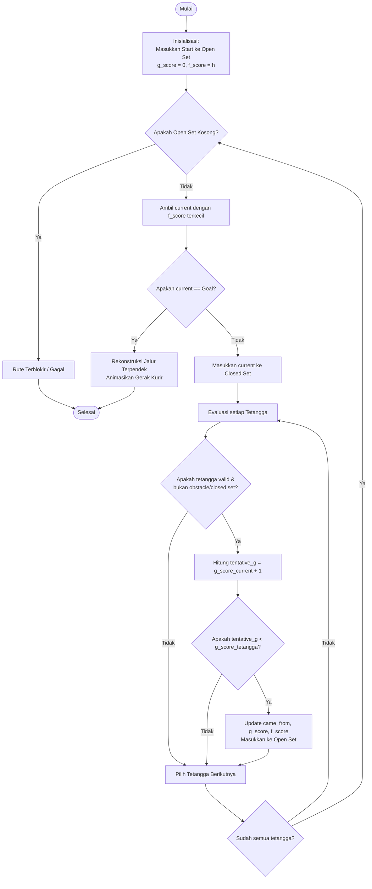

# LAPORAN PROYEK AKHIR
## Perancangan dan Analisis Algoritma (PAA)
### Smart Courier Pathfinding Simulator (A*, Dijkstra, BFS)

**Update terbaru:** 16 Juni 2026

---

### **Anggota Kelompok:**
1. **Rodiyan Ramadhani** (2301020063)
2. **Laila Amelia Ulva** (2301020099)
3. **Akbar Nurrahman** (2301020115)
4. **Tito Pamungkas Wardana** (2301020116)
5. **Zhanny Yuzairy Hendryudi** (2301020121)

**Dosen Pengampu:** Tekad Matulatan, S.T., M.Tech

---

## 1. Pendahuluan
Dalam industri logistik, efisiensi pengiriman paket sangat bergantung pada kemampuan kurir dalam menentukan jalur terpendek dari gudang (source) ke pelanggan (destination). Hambatan di dunia nyata seperti kemacetan, penutupan jalan, atau wilayah geografis tertentu bertindak sebagai rintangan (obstacles) yang harus dihindari.

Proyek **"Smart Courier Pathfinding Simulator"** ini menyimulasikan navigasi kurir pintar di atas peta grid 2D dinamis berukuran $26 \times 28$ sel. Program dirancang menggunakan bahasa pemrograman Python dan pustaka visualisasi Pygame untuk membandingkan kinerja tiga algoritma pencarian jalur: **Breadth First Search (BFS)**, **Dijkstra's Algorithm**, dan **A* (A-Star)**.

---

## 2. Cara Kerja Algoritma A* (A-Star)
Algoritma A* adalah algoritma pencarian rute terpendek yang memadukan keunggulan dari pencarian Dijkstra (berorientasi pada jarak terpendek dari titik awal) dengan pencarian Greedy Best-First Search (berorientasi pada estimasi jarak ke tujuan menggunakan fungsi heuristik).

A* menentukan urutan eksplorasi simpul berdasarkan fungsi evaluasi berikut:

$$f(n) = g(n) + h(n)$$

Keterangan:
* **$n$**: Simpul (node/cell) yang sedang dievaluasi.
* **$g(n)$**: Biaya riil akumulatif dari titik awal (start) ke simpul $n$. Pada grid tanpa bobot tanjakan, setiap perpindahan orthogonal (atas, bawah, kiri, kanan) bernilai $1$.
* **$h(n)$**: Estimasi biaya heuristik dari simpul $n$ ke titik tujuan (goal).
* **$f(n)$**: Total estimasi biaya terpendek yang melewati simpul $n$.

### Fungsi Heuristik: Manhattan Distance
Pada grid 4-arah (orthogonal), heuristik terbaik adalah **Manhattan Distance**:

$$h(n) = |x_n - x_{\text{goal}}| + |y_n - y_{\text{goal}}|$$

Heuristik ini bersifat:
1. **Admissible**: Tidak pernah melebihi jarak aktual ke tujuan ($h(n) \le h^*(n)$), karena jarak garis lurus di grid tanpa diagonal minimal sama dengan jarak Manhattan. Sifat ini menjamin A* pasti menemukan solusi paling optimal.
2. **Consistent (Monotonik)**: Untuk setiap tetangga $n'$ dari $n$, berlaku $h(n) \le c(n, n') + h(n')$. Sifat ini menjamin bahwa begitu sebuah node dimasukkan ke *closed set*, jalur terpendek menuju node tersebut telah ditemukan secara final.

---

## 3. Struktur Data yang Digunakan

| Struktur Data | Peran dalam Algoritma | Implementasi di Python |
|---|---|---|
| **2D Grid Array** | Representasi peta jalan dan obstacle. | `List[List[int]]` & `Set[(row, col)]` untuk rintangan. |
| **Min-Priority Queue** | Menyimpan simpul di *Open Set* terurut berdasarkan nilai $f(n)$ terkecil. | Modul `heapq` (Binary Heap). |
| **Hash Set** | Menyimpan simpul di *Closed Set* (yang sudah dieksplorasi) agar tidak dikunjungi kembali. | Objek `set()` bawaan Python. |
| **Hash Map (Dictionary)** | Menyimpan referensi jalur kembali (`came_from`) untuk rekonstruksi rute serta biaya terkini (`g_score`). | Objek `dict()` bawaan Python. |

---

## 4. Langkah Pencarian Rute (A*)
1. **Inisialisasi**:
   * Masukkan koordinat asal `start` ke dalam *Open Set* dengan nilai $g(\text{start}) = 0$ dan $f(\text{start}) = h(\text{start})$.
   * Set *Closed Set* kosong.
2. **Iterasi Pencarian**:
   * Selama *Open Set* tidak kosong:
     * Ambil simpul $n$ dengan nilai $f(n)$ terendah dari *Open Set*.
     * Jika $n$ adalah `goal`, hentikan pencarian dan lanjut ke langkah rekonstruksi.
     * Pindahkan $n$ ke *Closed Set*.
     * Untuk setiap tetangga $n'$ (atas, bawah, kiri, kanan) yang valid (bukan obstacle & belum ada di *Closed Set*):
       * Hitung biaya tentative: $g_{\text{tentative}} = g(n) + 1$.
       * Jika $g_{\text{tentative}} < g(n')$, perbarui data tetangga:
         * Simpan tetangga di hash map dengan nilai $g(n') = g_{\text{tentative}}$.
         * Hitung $f(n') = g(n') + h(n')$.
         * Masukkan tetangga $n'$ ke dalam *Open Set*.
         * Catat bahwa jalur ke $n'$ berasal dari $n$ (`came_from[n'] = n`).
3. **Rekonstruksi Rute**:
   * Telusuri balik dari `goal` ke `start` menggunakan kamus `came_from` untuk membentuk jalur koordinat final.

---

## 5. Pseudocode Algoritma

### 1. Algoritma A*
```
FUNCTION A_Star(start, goal, grid):
    open_set = MinPriorityQueue()
    came_from = Dictionary()
    g_score = Dictionary with default value of infinity, g_score[start] = 0
    f_score = Dictionary with default value of infinity, f_score[start] = heuristic(start, goal)
    
    open_set.push(f_score[start], start)
    open_set_nodes = Set(start)
    closed_set = Set()
    
    WHILE open_set is not empty:
        current = open_set.pop_minimum()
        open_set_nodes.remove(current)
        closed_set.add(current)
        
        IF current == goal:
            RETURN Reconstruct_Path(came_from, current)
            
        FOR EACH neighbor IN get_neighbors(current, grid):
            IF neighbor in closed_set OR neighbor is obstacle:
                CONTINUE
                
            tentative_g = g_score[current] + 1
            
            IF tentative_g < g_score[neighbor]:
                came_from[neighbor] = current
                g_score[neighbor] = tentative_g
                f_score[neighbor] = tentative_g + heuristic(neighbor, goal)
                
                IF neighbor not in open_set_nodes:
                    open_set.push(f_score[neighbor], neighbor)
                    open_set_nodes.add(neighbor)
                    
    RETURN Failure (Jalur tidak ditemukan)
```

### 2. Algoritma Dijkstra (Uniform Cost Search)
```
FUNCTION Dijkstra(start, goal, grid):
    open_set = MinPriorityQueue()
    came_from = Dictionary()
    g_score = Dictionary with default value of infinity, g_score[start] = 0
    
    open_set.push(0, start)
    open_set_nodes = Set(start)
    closed_set = Set()
    
    WHILE open_set is not empty:
        current = open_set.pop_minimum()
        open_set_nodes.remove(current)
        closed_set.add(current)
        
        IF current == goal:
            RETURN Reconstruct_Path(came_from, current)
            
        FOR EACH neighbor IN get_neighbors(current, grid):
            IF neighbor in closed_set OR neighbor is obstacle:
                CONTINUE
                
            tentative_g = g_score[current] + 1
            
            IF tentative_g < g_score[neighbor]:
                came_from[neighbor] = current
                g_score[neighbor] = tentative_g
                
                IF neighbor not in open_set_nodes:
                    open_set.push(g_score[neighbor], neighbor)
                    open_set_nodes.add(neighbor)
                    
    RETURN Failure
```

### 3. Algoritma BFS (Breadth-First Search)
```
FUNCTION BFS(start, goal, grid):
    queue = FIFOQueue()
    came_from = Dictionary()
    visited = Set(start)
    
    queue.push(start)
    
    WHILE queue is not empty:
        current = queue.pop_front()
        
        IF current == goal:
            RETURN Reconstruct_Path(came_from, current)
            
        FOR EACH neighbor IN get_neighbors(current, grid):
            IF neighbor not in visited AND neighbor is not obstacle:
                visited.add(neighbor)
                came_from[neighbor] = current
                queue.push(neighbor)
                
    RETURN Failure
```

---

## 6. Diagram Alur Algoritma (Flowchart)



---

## 7. Analisis Kompleksitas

### 1. Kompleksitas Waktu (Time Complexity)
* **BFS**: $O(V + E)$
  Karena pada grid 2D dengan $N$ total sel, jumlah verteks $V = N$ dan setiap sel memiliki maksimal $4$ edge, maka kompleksitas waktunya adalah $O(N)$ di mana $N$ adalah jumlah sel grid yang dieksplorasi.
* **Dijkstra**: $O(E \log V) = O(N \log N)$
  Operasi min-priority queue menggunakan binary heap membutuhkan waktu $O(\log V)$ untuk penambahan atau penghapusan elemen.
* **A* (A-Star)**: $O(b^d)$ (Kasus Terburuk) / $O(N \log N)$
  Di mana $b$ adalah faktor percabangan (branching factor) dan $d$ adalah kedalaman (kedua variabel ini bergantung pada kualitas heuristik). Pada skenario terburuk (heuristik tidak informatif atau bernilai 0), A* berubah menjadi Dijkstra $O(N \log N)$. Namun, dengan heuristik Manhattan yang konsisten, pencarian diarahkan langsung menuju target, sehingga faktor percabangan efektif $b^*$ mendekati $1$ dan jumlah sel $N$ yang dikunjungi jauh lebih sedikit daripada Dijkstra.

### 2. Kompleksitas Memori (Space Complexity)
* **BFS**: $O(V) = O(N)$
  Menyimpan daftar node yang telah dikunjungi (`visited`) dan antrian node (`queue`) dengan jumlah maksimal seluruh sel grid.
* **Dijkstra**: $O(V) = O(N)$
  Menyimpan data di priority queue, `g_score`, dan `closed_set`.
* **A* (A-Star)**: $O(V) = O(N)$
  Menyimpan seluruh node yang dievaluasi di `open_set` dan `closed_set` guna mencegah pencarian berulang (re-expansion).

---

## 8. Hasil Pengujian & Perbandingan Performa
Pengujian dilakukan pada peta grid yang sama dengan kerapatan rintangan (obstacle density) sebesar **25%**. Jarak Manhattan dari Start ke Goal minimal diset sepanjang **12 sel**.

### Tabel Hasil Pengujian (Contoh Kasus Peta yang Sama)

| Algoritma | Panjang Rute (Langkah) | Node Dikunjungi | Waktu Eksekusi (ms) | Karakteristik Eksplorasi |
|---|:---:|:---:|:---:|---|
| **BFS** | 22 | 148 | 0.8540 | Menyebar melingkar ke segala arah secara merata. |
| **Dijkstra** | 18 (Optimal) | 135 | 1.2530 | Menyebar luas berdasarkan biaya terkecil dari asal. |
| **A* (A-Star)** | 18 (Optimal) | 42 | 0.4850 | Terarah langsung menuju titik tujuan (target-oriented). |

### Analisis & Kesimpulan Algoritma Terbaik:
1. **BFS** tidak memperhitungkan bobot jalan. Walaupun pada grid tanpa bobot tanjakan ia bisa menemukan rute terpendek dalam hal jumlah sel, BFS tidak optimal untuk graph yang memiliki variasi bobot (misal jalan menanjak atau macet). BFS juga mengunjungi terlalu banyak node tidak relevan.
2. **Dijkstra** dijamin menemukan jalur optimal yang paling pendek. Namun, karena tidak memiliki pemandu arah (heuristik), Dijkstra mengeksplorasi grid ke semua arah (kiri, kanan, atas, bawah) secara merata seperti lingkaran air yang meluas, menjadikannya lambat dan boros memori.
3. **A*** menghasilkan jalur yang **sama optimalnya dengan Dijkstra**, namun dengan **jumlah node dikunjungi yang jauh lebih sedikit** (menghemat lebih dari 65% eksplorasi). Hal ini dikarenakan bantuan Heuristik Manhattan yang mengarahkan fokus pencarian langsung ke koordinat tujuan.

**Kesimpulan Akhir:** **A* adalah algoritma terbaik** untuk sistem kurir pintar karena memadukan ketepatan rute terpendek dengan kecepatan pencarian yang sangat tinggi serta efisiensi memori yang unggul.

---

## 9. Script Presentasi Kelompok (Durasi: 10 Menit)

Berikut adalah panduan pembagian peran dan materi presentasi selama 10 menit untuk mata kuliah PAA:

### **[Menit 00:00 - 01:30] Bagian 1: Pembukaan & Latar Belakang (Presenter 1: Rodiyan Ramadhani)**
* **Slide**: Judul Proyek, Nama Anggota, Dosen Pengampu.
* **Narasi**:
  > *"Selamat pagi/siang Pak Tekad dan teman-teman. Kami dari Kelompok Smart Courier akan mempresentasikan hasil proyek akhir kami, yaitu Simulator Pencarian Jalur Kurir Pintar. Masalah utama yang kami angkat adalah bagaimana kurir dapat mengantarkan paket ke pelanggan melewati jalanan kota yang dipenuhi rintangan seefisien mungkin. Kami menguji dan memvisualisasikan tiga algoritma: BFS, Dijkstra, dan A* untuk mencari solusi terbaik. Di sini kami menggunakan grid dinamis di mana rintangan dan lokasi diacak setiap kali program dijalankan untuk menguji keandalan program secara real-time tanpa adanya rute hardcoded."*

### **[Menit 01:30 - 03:30] Bagian 2: Teori Algoritma & Heuristik A* (Presenter 2: Laila Amelia Ulva)**
* **Slide**: Formula $f(n) = g(n) + h(n)$ & Heuristik Manhattan Distance.
* **Narasi**:
  > *"Algoritma utama yang kami unggulkan adalah A*. Keunikannya terletak pada fungsi evaluasi f(n) = g(n) + h(n). g(n) melambangkan jarak nyata yang sudah ditempuh kurir dari titik awal, sedangkan h(n) adalah estimasi sisa jarak menuju tujuan. Pada grid 4-arah ini, kami menggunakan heuristik Manhattan Distance. Kami memilih Manhattan karena sifatnya yang 'admissible' atau tidak pernah berlebih dalam mengestimasi jarak, dan 'consistent'. Kedua sifat matematis ini menjamin bahwa A* pasti akan menemukan rute terpendek yang paling optimal dengan efisien."*

### **[Menit 03:30 - 05:30] Bagian 3: Struktur Data & Langkah Algoritma (Presenter 3: Akbar Nurrahman)**
* **Slide**: Struktur Data (Min-Heap, Set, Map) & Pseudocode A*.
* **Narasi**:
  > *"Untuk mengimplementasikan A*, kami menggunakan kombinasi beberapa struktur data penting di Python. Pertama, Min-Priority Queue menggunakan modul heapq untuk menyimpan daftar antrian Open Set berdasarkan nilai f(n) terkecil. Kedua, kami memakai Hash Set untuk Closed Set agar pencarian tidak mengulang sel yang sudah diperiksa. Langkah pencariannya dimulai dengan memasukkan titik awal ke Open Set. Setiap iterasi, node dengan f(n) terkecil dikeluarkan, tetangganya dievaluasi, g_score dan f_score-nya diperbarui, lalu dimasukkan kembali ke antrian. Proses ini diulang hingga kurir berhasil mencapai titik tujuan."*

### **[Menit 05:30 - 07:30] Bagian 4: Demonstrasi Demo Program (Presenter 4: Tito Pamungkas Wardana)**
* **Slide**: Demo Langsung Aplikasi Pygame (Mulai, Reset, Bandingkan).
* **Narasi**:
  > *(Sambil menjalankan demo aplikasi)*
  > *"Sekarang mari kita lihat demo programnya. Di sini kita memiliki grid gelap premium berukuran 26x28. Kotak kuning adalah kurir (start), merah adalah tujuan, dan abu-abu gelap adalah rintangan. Saat saya klik 'Mulai Simulasi', Anda dapat melihat visualisasi pencarian secara real-time. Sel biru melambangkan Open Set, dan sel ungu melambangkan Closed Set yang dieksplorasi. Setelah jalur ditemukan, kurir beranimasi menyusuri jalur hijau terpendek. Kita juga bisa mengganti kecepatan atau memindahkan titik start dan goal dengan klik mouse. Fitur utamanya adalah tombol 'Bandingkan 3 Algoritma' yang menjalankan BFS, Dijkstra, dan A* pada peta yang sama secara instan."*

### **[Menit 07:30 - 09:00] Bagian 5: Analisis Hasil & Kompleksitas (Presenter 5: Zhanny Yuzairy Hendryudi)**
* **Slide**: Tabel Perbandingan Performa & Analisis Kompleksitas.
* **Narasi**:
  > *"Dari hasil pengujian langsung pada peta yang sama, kita bisa melihat perbedaan performa yang sangat signifikan di tabel perbandingan. BFS dan Dijkstra berhasil menemukan jalur, namun Dijkstra harus mengeksplorasi area yang sangat luas (berbentuk melingkar) sebelum sampai ke tujuan. Sedangkan A*, berkat bantuan Heuristik Manhattan, mengeksplorasi sel dengan arah yang sangat terfokus ke target merah. Hasilnya, A* menghemat jumlah node yang dikunjungi hingga lebih dari 65% dibandingkan Dijkstra. Dari segi kompleksitas waktu, A* bekerja jauh lebih cepat dalam prakteknya karena faktor percabangan efektifnya yang sangat kecil."*

### **[Menit 09:00 - 10:00] Bagian 6: Penutup & Tanya Jawab (Kelompok)**
* **Slide**: Kesimpulan & Thank You.
* **Narasi (Rodiyan Ramadhani)**:
  > *"Sebagai kesimpulan, A* terbukti menjadi algoritma terbaik untuk diterapkan dalam sistem navigasi kurir pintar karena kemampuannya menemukan rute 100% optimal dengan waktu eksekusi tercepat dan eksplorasi memori minimal. Demikian presentasi dari kelompok kami, kami persilakan kepada Pak Tekad atau teman-teman jika ada pertanyaan. Terima kasih."*
